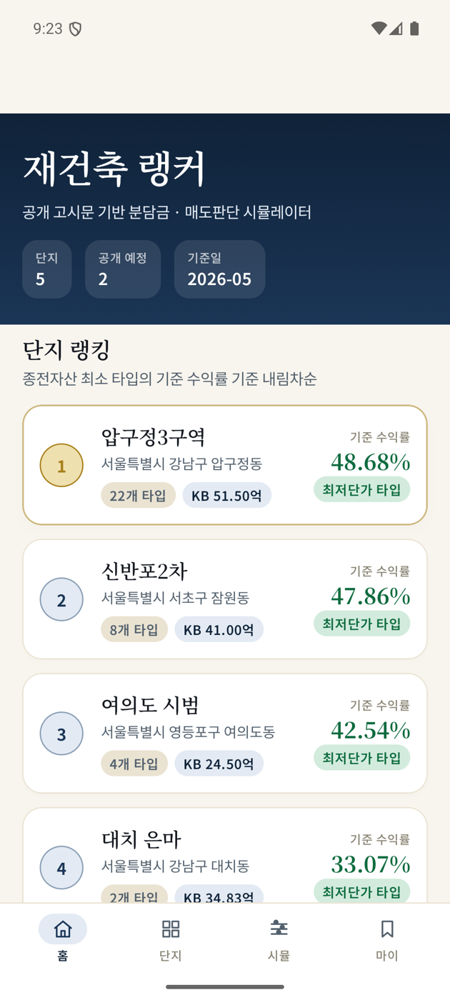
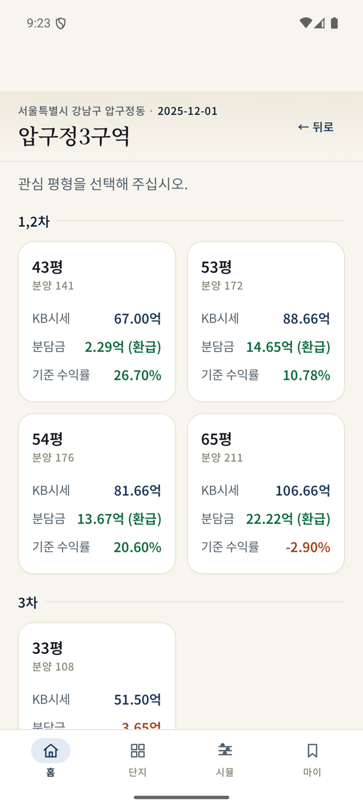
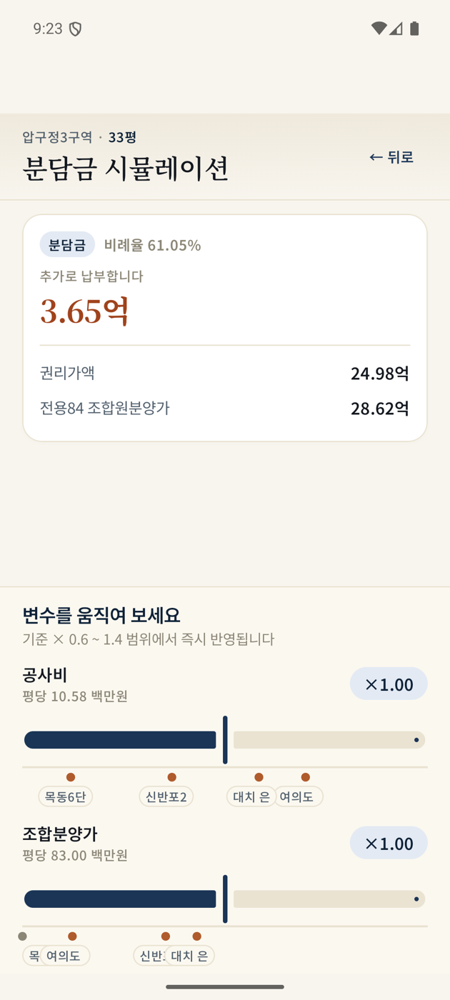
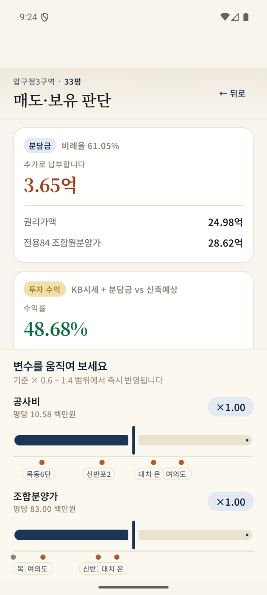

# 재잘 (Jaejal) · 재건축 분담금 퀘스트

> 공개 고시문 기반 분담금 · 매도판단 시뮬레이터 — Kotlin Multiplatform (iOS + Android)

[](https://www.jetbrains.com/lp/compose-multiplatform/)
[](https://kotlinlang.org/)
[](https://developer.android.com/)
[](https://developer.apple.com/ios/)

서울 주요 재건축 단지(압구정3구역·신반포2차·여의도시범·대치 은마·목동6단지)의 분담금과 매도·보유 판단을
**한 화면에서 슬라이더로 즉시 시뮬레이션**하는 모바일 앱입니다.
17년 감정평가 실무에서 반복되던 두 질문 — *"얼마 더 내야 하나?"* 와 *"지금 팔아야 하나?"* — 에
공개 고시문 데이터로 답합니다.

<p align="center">
  
  
  
  
</p>

전체 화면 시안: [**`docs/mockup.html`**](docs/mockup.html) — 12장의 폰 프레임 시안을 한 페이지에 정리한 PO 검토용 HTML.

---

## 핵심 기능

- **6단계 흐름** — 랭킹 → 평형 선택 → 질문 선택 → 면책 동의 → 시뮬레이션 (Q1 분담금 / Q2 매도판단)
- **4개 하단 탭** — 홈 · 단지 · 시뮬 (최근 기록) · 마이
- **선형 스케일링 계산 엔진** — 공사비·조합분양가·일반분양가·신축 예상가의 4종 슬라이더로 분담금·총투자금·마진·수익률을 실시간 계산
- **다른 단지 마커** — 슬라이더 위에 동일 변수의 peer-district 위치를 점·칩으로 표시 (시장 감각)
- **건설 트러스트 디자인 시스템** — 양피지 배경 · 네이비 강조 · 동(銅)·골드 액센트 · Noto Serif KR 헤딩 · Noto Sans KR 본문
- **KMP 공통 모듈 100%** — 계산 엔진 · 데이터 모델 · UI 모두 commonMain. 플랫폼별 코드는 진입점 + 시간 함수만.

## 검증

계산 엔진은 원본 엑셀 DB의 기준값(`AJ` 비례율, `AZ` 분담금, `AU` 총투자금, `AV` 마진, `BB` 수익률)과
**41개 타입 전부 소수점 둘째 자리까지 일치**합니다. 자동화 테스트로 회귀를 방지합니다.

| 단지 | 타입 | 분담금 (백만원) | 총투자금 | 마진 | 수익률 |
|---|---|---:|---:|---:|---:|
| 신반포2차 | 전용 68.91㎡ | 982.99 | 5,082.99 | 2,432.71 | 47.86% |
| 압구정3구역 | 3차 33평 | 365.36 | 6,500.00 | 1,698.94 | 26.13% |
| 여의도시범 | 전용 156.99㎡ | 1,454.34 | 14,454.34 | 6,029.32 | 41.71% |

```sh
./gradlew :composeApp:iosSimulatorArm64Test   # macOS: runs on iOS simulator
```

전체 검증 케이스: [`composeApp/src/commonTest/kotlin/.../RepositoryDataTest.kt`](composeApp/src/commonTest/kotlin/com/jaejal/reconstruction/data/RepositoryDataTest.kt).

---

## 빠른 시작 (Quick start)

### 1. Clone + fonts

```sh
git clone git@github.com:hanshin-lee/reconstruction-ranker.git
cd reconstruction-ranker
./scripts/install-fonts.sh           # ~64MB Noto Sans/Serif KR from Google Fonts
```

### 2. Android

```sh
./gradlew :composeApp:assembleDebug                  # build APK
./gradlew :composeApp:installDebug                   # install on connected device/emulator
```

또는 Android Studio에서 `composeApp` 모듈을 열어 ▶ 실행.

### 3. iOS

```sh
# Kotlin → ComposeApp.framework 생성 (Xcode 26+ 권장)
./gradlew :composeApp:linkDebugFrameworkIosSimulatorArm64
```

Android Studio (KMM 플러그인) 또는 Xcode에서 `iosApp/iosApp` 디렉토리의 Swift 파일들을
포함한 새 iOS 프로젝트를 만든 뒤, 다음 Run Script Phase를 추가합니다:

```sh
cd "$SRCROOT/.."
./gradlew :composeApp:embedAndSignAppleFrameworkForXcode
```

`local.properties`에 `sdk.dir=/path/to/Android/sdk`가 필요합니다 (Android SDK 위치).

---

## 프로젝트 구조

```
composeApp/
├── src/
│   ├── commonMain/kotlin/com/jaejal/reconstruction/
│   │   ├── calc/Engine.kt              # 선형 스케일링 계산 엔진 (PRD §8)
│   │   ├── data/
│   │   │   ├── Models.kt               # District / DistrictBase / TypeInfo / SimulationResult
│   │   │   └── Repository.kt           # JSON 로드 + 랭킹
│   │   ├── format/Format.kt            # 억 / % / 환급 표기
│   │   ├── design/                     # ← 디자인 시스템
│   │   │   ├── Tokens.kt               # 색상 · 간격 · radii · 모션
│   │   │   ├── Theme.kt                # M3 ColorScheme + Typography (Noto KR)
│   │   │   ├── Components.kt           # TrustCard · ToneChip · RankBadge · HeroNumber
│   │   │   ├── SimulatorSlider.kt      # peer-marker 슬라이더
│   │   │   ├── BottomNavBar.kt         # 하단 탭 바
│   │   │   └── Icons.kt                # 손글씨 vector 아이콘 4종
│   │   └── ui/
│   │       ├── AppState.kt             # 탭 + 라우트 스택 상태
│   │       ├── PlatformBack.kt         # expect (Android: BackHandler / iOS: no-op)
│   │       ├── Screens.kt              # AppShell + 6개 핵심 화면
│   │       └── TabScreens.kt           # 단지 · 시뮬 · 마이 탭
│   ├── commonMain/composeResources/
│   │   ├── files/districts.json        # 5개 단지 × 41개 타입
│   │   └── font/                       # Noto Sans/Serif KR (install-fonts.sh로 받음)
│   ├── commonTest/                     # 엔진 + 데이터셋 회귀 테스트
│   ├── androidMain/                    # MainActivity + 매니페스트 + 테마
│   └── iosMain/                        # MainViewController
iosApp/iosApp/                          # Swift 호스트 (ContentView + iOSApp + Info.plist)
docs/
├── PRD.md                              # 한신씨 MVP 구현요청서 v0.6
├── source-db.xlsx                      # 원본 엑셀 DB
├── mockup.html                         # PO 검토용 시안 (12 화면 단일 페이지)
└── screenshots/                        # 실제 디바이스 캡처
scripts/install-fonts.sh                # 폰트 설치 스크립트
```

---

## 디자인 시스템

> 컨셉: **건설의 신뢰감** — 양피지(설계도) · 네이비(강철·전문성) · 동(공구) · 골드(수상) · 숲녹색(이익) · 테라코타(손실)

| 토큰 | 값 | 용도 |
|---|---|---|
| `Paper` | `#F8F5EE` | 앱 배경 |
| `Navy` | `#1B3556` | 주요 액션 · 브랜드 |
| `Copper` | `#B05B2C` | 액센트 |
| `Gold` | `#A8801A` | 1위 강조 |
| `Gain` | `#0E6B3E` | 환급 / 이익 |
| `Loss` | `#A0431C` | 납부 / 손실 |

타이포그래피는 **Noto Serif KR**(헤딩·히어로 수치)과 **Noto Sans KR**(본문·라벨)을 SIL OFL 1.1 라이선스로
번들합니다. 첫 빌드 전 `./scripts/install-fonts.sh`로 받아 `composeApp/src/commonMain/composeResources/font/`에
배치하세요.

---

## 데이터 출처

5개 단지의 베이스값은 모두 **서울시 공개 고시문**에서 추출했습니다:

1. 압구정3구역 — 강남구 공고 제 2025-2711호 (2025-12-01)
2. 신반포2차 — 정비구역지정 (2024-07-11)
3. 여의도 시범 — 정비계획 결정고시 250213 (2025-02-13)
4. 대치 은마 — 서울시고시 2025-655 (2025-11-27)
5. 목동6단지 — 정비구역지정 (2024-08-16)

KB시세 데이터는 2026-05-18 시점입니다. 자세한 원본 PDF는 PRD 작성자에게 별도 요청.

---

## PRD 참조

- 계산 공식: [`docs/PRD.md`](docs/PRD.md) §8 — `Engine.kt`와 동일
- 디자인 가이드: [`docs/PRD.md`](docs/PRD.md) §7 — `Tokens.kt`에 반영
- 인수 기준: [`docs/PRD.md`](docs/PRD.md) §6 — `RepositoryDataTest`로 자동 검증
- 미해결 제품 결정 (이재민 답변 필요 15개): [`docs/PRD.md`](docs/PRD.md) §10

---

## 라이선스

코드는 향후 별도 결정. 번들 폰트는 **SIL Open Font License 1.1** ([fonts/OFL.txt](composeApp/src/commonMain/composeResources/font/OFL.txt)).

---

## 기여 (Internal)

| 역할 | 담당 |
|---|---|
| Founder / PO | 이재민 — 도메인 의사결정, 디자인 실행 |
| 운영 / UX | 바름 — 피드백 분석, 마케팅 |
| Engineering | 한신 — KMP 아키텍처, 구현 |
